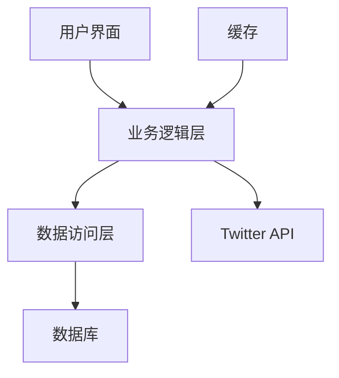
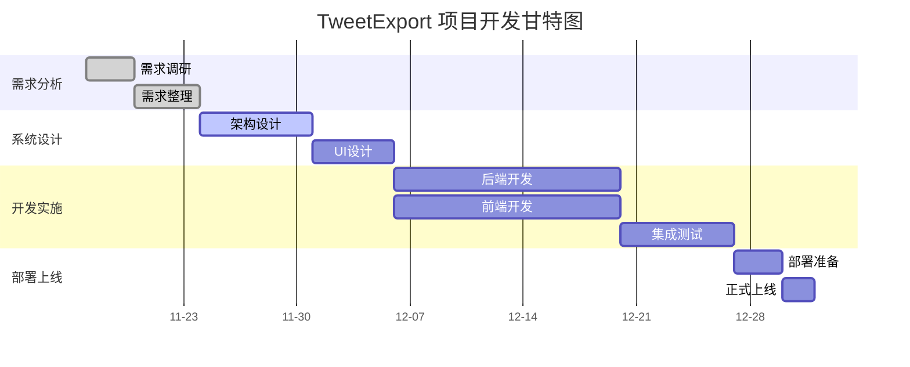

<div class="plan-header">

# 🚀 AI生成的开发计划

<div class="meta-info">

**⏰ 生成时间：** 2025-11-14 16:01:36  
**🤖 AI模型：** Qwen2.5-72B-Instruct  
**💡 基于用户创意智能分析生成**  
**🔗 Agent应用MCP服务增强**

</div>

</div>

---

# TweetExport 开发计划

## 产品概述

### 产品名称
TweetExport

### 产品目标
开发一款 Chrome 扩展工具，帮助 Twitter 用户高效地导出其个人或关注对象的推文及多媒体内容。该工具提供一个直观的用户界面，展示用户的历史推文列表，支持多选操作，可一次性导出选定的推文及其附带的图片、视频等媒体资源。导出的文件将以日期时间加用户名的形式命名，确保文件的唯一性和便于管理。

### 主要功能

### 📋 1. 用户登录：支持 Twitter 账号登录。


### 📋 2. 推文列表展示：展示用户的历史推文列表。


### 📋 3. 多选操作：支持多选推文进行批量操作。


### 📋 4. 导出功能：支持导出选定的推文及其附带的图片、视频等媒体资源。


### 📋 5. 文件命名：导出的文件将以日期时间加用户名的形式命名。


## 技术方案

### 技术栈
- **前端**：React, Redux, Material-UI
- **后端**：Node.js, Express
- **存储**：MongoDB
- **认证**：OAuth 2.0
- **扩展开发**：Chrome Extension API

### 架构图


### 技术栈对比
| 技术栈 | 前端 | 后端 | 存储 | 认证 | 扩展开发 |
|--------|------|------|------|------|----------|
| 选择   | React | Node.js | MongoDB | OAuth 2.0 | Chrome Extension API |
| 备选   | Vue.js | Flask | PostgreSQL | JWT | Firefox Add-on API |

## 开发计划


#### 🚀 第1阶段：需求分析（2025-11-17 至 2025-11-20）

- **需求调研**：与潜在用户沟通，收集需求。
- **需求整理**：整理需求文档，明确功能点。


#### 🚀 第2阶段：系统设计（2025-11-21 至 2025-11-28）

- **架构设计**：设计系统架构图。
- **UI设计**：设计用户界面原型。
- **技术选型**：确定最终技术栈。


#### 🚀 第3阶段：开发实施（2025-11-29 至 2026-01-10）

- **后端开发**：实现后端服务，包括用户认证、数据存储等。
- **前端开发**：实现前端页面，包括用户登录、推文列表展示、多选操作等。
- **集成测试**：进行前后端集成测试，确保功能正常。


#### 🚀 第4阶段：部署上线（2026-01-11 至 2026-01-15）

- **部署准备**：准备部署环境，配置服务器。
- **正式上线**：发布 Chrome 扩展到 Chrome Web Store。

### 甘特图


## 部署方案
- **服务器**：使用 AWS EC2 实例作为后端服务器。
- **数据库**：使用 MongoDB Atlas 作为数据库服务。
- **前端**：将前端应用部署到 AWS S3，并通过 CloudFront 进行 CDN 分发。
- **扩展**：将 Chrome 扩展发布到 Chrome Web Store。

## 推广策略
- **社交媒体**：利用 Twitter、Facebook 等平台进行宣传。
- **博客文章**：撰写技术博客，介绍开发过程和使用方法。
- **社区活动**：参加开发者大会和技术沙龙，展示产品。
- **合作伙伴**：与数据分析师、内容创作者等合作，推广产品。

---


<div class="prompts-highlight">

# 🤖 AI编程助手提示词

> 💡 **使用说明**：以下提示词基于您的项目需求定制生成，可直接复制到 GitHub Copilot、ChatGPT、Claude 等AI编程工具中使用


### 🎯 用户登录开发提示词


```
请为 TweetExport 开发用户登录功能。

项目背景：
TweetExport 是一款 Chrome 扩展工具，帮助 Twitter 用户高效地导出其个人或关注对象的推文及多媒体内容。用户需要通过 Twitter 账号登录才能使用该工具。

功能要求：
1. 支持 Twitter 账号登录。
2. 使用 OAuth 2.0 进行身份验证。
3. 登录成功后，保存用户的访问令牌。
4. 登录失败时，显示错误提示。

技术约束：
- 使用 React 和 Redux 进行前端开发。
- 使用 Node.js 和 Express 进行后端开发。
- 使用 OAuth 2.0 进行身份验证。
- 实现错误处理机制。

输出要求：
- 完整可运行代码
- 详细注释说明
- 错误处理机制
- 测试用例
```


### 🎯 推文列表展示开发提示词


```
请为 TweetExport 开发推文列表展示功能。

项目背景：
TweetExport 是一款 Chrome 扩展工具，帮助 Twitter 用户高效地导出其个人或关注对象的推文及多媒体内容。用户登录后，可以在用户界面上查看历史推文列表。

功能要求：
1. 展示用户的历史推文列表。
2. 每条推文显示内容、发布时间、点赞数、评论数等信息。
3. 支持分页加载更多推文。
4. 支持搜索功能，用户可以通过关键词搜索推文。

技术约束：
- 使用 React 和 Redux 进行前端开发。
- 使用 Node.js 和 Express 进行后端开发。
- 使用 MongoDB 存储推文数据。
- 实现错误处理机制。

输出要求：
- 完整可运行代码
- 详细注释说明
- 错误处理机制
- 测试用例
```


### 🎯 多选操作开发提示词


```
请为 TweetExport 开发多选操作功能。

项目背景：
TweetExport 是一款 Chrome 扩展工具，帮助 Twitter 用户高效地导出其个人或关注对象的推文及多媒体内容。用户可以在推文列表中选择多条推文进行批量操作。

功能要求：
1. 支持多选推文。
2. 提供全选/取消全选按钮。
3. 显示已选中的推文数量。
4. 支持删除已选中的推文（可选）。

技术约束：
- 使用 React 和 Redux 进行前端开发。
- 使用 Node.js 和 Express 进行后端开发。
- 使用 MongoDB 存储推文数据。
- 实现错误处理机制。

输出要求：
- 完整可运行代码
- 详细注释说明
- 错误处理机制
- 测试用例
```


### 🎯 导出功能开发提示词


```
请为 TweetExport 开发导出功能。

项目背景：
TweetExport 是一款 Chrome 扩展工具，帮助 Twitter 用户高效地导出其个人或关注对象的推文及多媒体内容。用户可以选择多条推文并导出为文件。

功能要求：
1. 支持导出选定的推文及其附带的图片、视频等媒体资源。
2. 导出的文件格式为 JSON 或 CSV。
3. 导出的文件以日期时间加用户名的形式命名，确保文件的唯一性。
4. 提供导出进度条，显示导出进度。

技术约束：
- 使用 React 和 Redux 进行前端开发。
- 使用 Node.js 和 Express 进行后端开发。
- 使用 MongoDB 存储推文数据。
- 实现错误处理机制。

输出要求：
- 完整可运行代码
- 详细注释说明
- 错误处理机制
- 测试用例
```


### 🎯 文件命名开发提示词


```
请为 TweetExport 开发文件命名功能。

项目背景：
TweetExport 是一款 Chrome 扩展工具，帮助 Twitter 用户高效地导出其个人或关注对象的推文及多媒体内容。用户可以选择多条推文并导出为文件，文件命名需要确保唯一性和便于管理。

功能要求：
1. 导出的文件以日期时间加用户名的形式命名。
2. 日期时间格式为 YYYY-MM-DD_HH-MM-SS。
3. 用户名从 Twitter 账号获取。
4. 确保文件名不重复。

技术约束：
- 使用 React 和 Redux 进行前端开发。
- 使用 Node.js 和 Express 进行后端开发。
- 使用 MongoDB 存储推文数据。
- 实现错误处理机制。

输出要求：
- 完整可运行代码
- 详细注释说明
- 错误处理机制
- 测试用例
```


</div>
